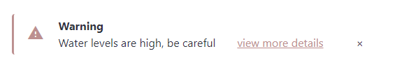

# streamlit_pretty_notification_box
An alternative to its [sibling](https://github.com/Socvest/streamlit-custom-notification-box) but looks prettier. The ability to add a title is included.

If you need a notification bar with the ability to redirect users to an external site (optional) and to pop up and be able to close it out, then give this a try. 
Its possible to change the colour, the image to correspond to the type of notification of your choice (warning, information, success etc). The image below is an example of information:

 

Its built on the [streamlit custom components typescript template](https://github.com/streamlit/component-template)

To install it:
```
pip install streamlit-pretty-notification-box
```

**Variables**

- icon: from [here](https://fonts.google.com/icons)
- title: title of the notification
- textDisplay: Text to display
- externalLink: External link to send users to (optional)
- url: The url that users will be sent to
- styles: The optional CSS styling you want for the component
- key
- defaultIndex


```
from streamlit_custom_notification_box import custom_notification_box
st.subheader("Component with constant args")

styles = {'material-icons':{'color': 'red'},
          'title': {'font-weight':'bold'},
          'notification-content-container': {'':''},
          'title-text-url-container': {'',''},
          'notification-text-link-close-container': {'',''},
          'external-link': {'',''},
          'close-button': {'',''}}

notification_box(icon='warning', title='Warning', textDisplay='Water levels are high, be careful', externalLink='view more details',
                                url='https://www.cdc.gov/healthywater', styles=None, key='foo')
```
